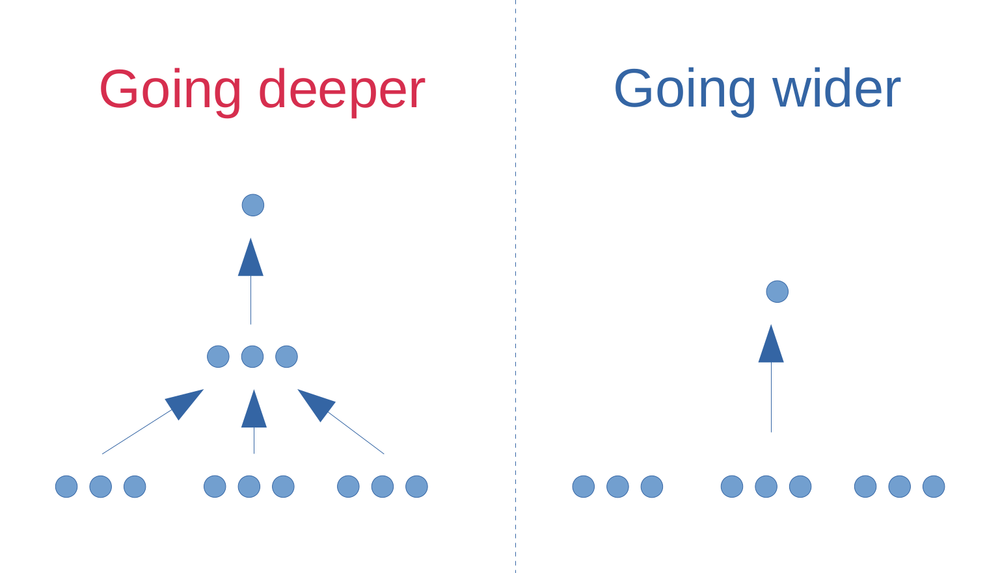
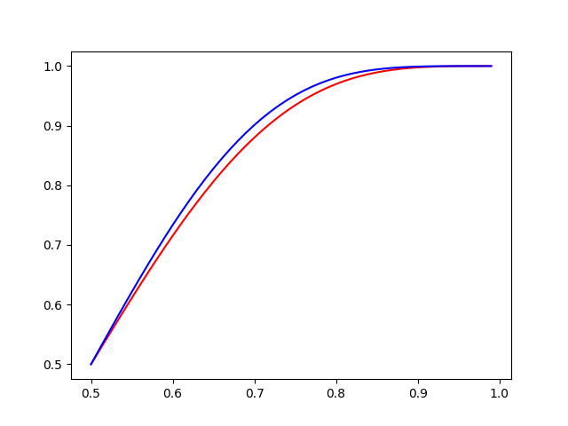
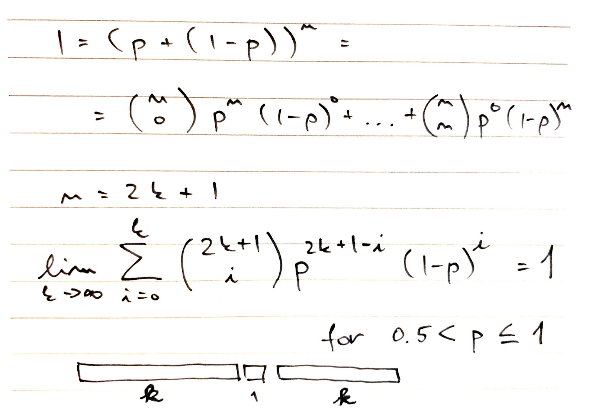
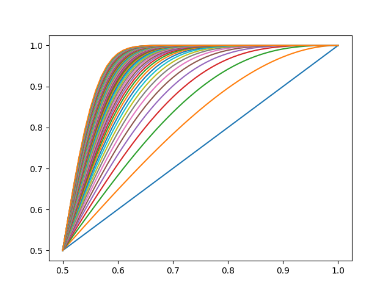

# [Deep vs Wide](https://www.frisky.world/p/deep-vs-wide.html)
Currently, in machine learning, deep learning publications dominate over wide networks, but when not looking at current trends and concentrating only on precision (accuracy), the differences might not be as big as some might think.

| Dataset  | Deep Networks | Wide Networks |
| ------------- | ------------- | ------------- |
| [TIMIT](https://catalog.ldc.upenn.edu/LDC93S1) & [CIFAR-10](https://www.cs.toronto.edu/~kriz/cifar.html) | [Acoustic modeling using deep belief networks](https://ieeexplore.ieee.org/document/5704567)  |  [Do Deep Nets Really Need to be Deep?](https://papers.nips.cc/paper/5484-do-deep-nets-really-need-to-be-deep) |
| [NORB](https://cs.nyu.edu/~ylclab/data/norb-v1.0/) & [CIFAR-10](https://www.cs.toronto.edu/~kriz/cifar.html) | [Learning methods for generic object recognition with invarianceto pose and lighting](https://ieeexplore.ieee.org/document/1315150)  | [An analysis of single-layer networks in unsupervised feature learning](http://proceedings.mlr.press/v15/coates11a.html)  |
| [MNIST](http://yann.lecun.com/exdb/mnist/) & [ADS](https://archive.ics.uci.edu/ml/datasets/adult) | [Stochastic pooling for regularization of deep convolutional neural networks](https://www.semanticscholar.org/paper/Stochastic-Pooling-for-Regularization-of-Deep-Zeiler-Fergus/0abb49fe138e8fb7332c26b148a48d0db39724fc)  | [Linear Regression on a Set of Selected Templates from a Pool of Randomly Generated Templates](https://www.researchgate.net/publication/336933653_Linear_Regression_on_a_Set_of_Selected_Templates_from_a_Pool_of_Randomly_Generated_Templates) &  [slides for On Linear Regression](https://www.researchgate.net/publication/338686641_Word_Replaceability_On_Linear_Regression) |

Motivation: Let's have 9 features of same probability of correctness p, which is in (0.5, 1.0]. What is the output probability when we combine 9 features together (majority of features is correct) - blue line and when we do it in deep manner (3 features create 1 new feature and then we combine 3 new features together) - red line?

Blue line is always above red line (python3 lin01.py).

Now what if we go to infinity?

As it turns out, if we can generate infinite amount of features with probability of correctness from (0.5, 1.0], all we have to do is count which features are for and which are against.

Instead of technical proof, here is a graph how sum of first k+1 terms in expansion of (p+(1-p))^(2k+1) evolves with increasing k:

(python3 lin03.py)
